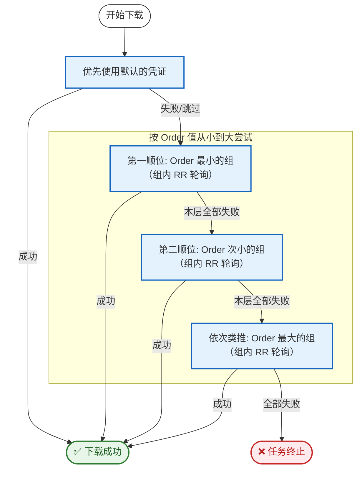

# Kmoe Manga Downloader

[](https://pepy.tech/projects/kmoe-manga-downloader) [](https://pypi.org/project/kmoe-manga-downloader/) [](https://github.com/chrisis58/kmdr/actions/workflows/unit-test.yml) [](https://github.com/chrisis58/kmoe-manga-downloader/actions/workflows/validate-mirrors.yml) [](https://www.python.org/) [](https://github.com/chrisis58/kmdr/blob/main/LICENSE) [](https://github.com/chrisis58/kmdr)

`kmdr (Kmoe Manga Downloader)` 是一个 Python 终端应用，用于从 [Kmoe](https://kxx.moe/) 网站下载漫画。它支持在终端环境下的登录、下载指定漫画及其卷，并支持回调脚本执行。

<table style="min-width: 600px;">
  <tbody>
    <tr>
      <td style="text-align: center;" width="100">
        交互模式
      </td>
      <td style="text-align: center;">
        
      </td>
    </tr>
    <tr>
      <td style="text-align: center;" width="100">
        日志模式
      </td>
      <td style="text-align: center;">
        
      </td>
    </tr>
  </tbody>
</table>

## ✨功能特性

- **现代化终端界面**: 基于 [rich](https://github.com/Textualize/rich) 构建的终端用户界面（TUI），提供进度条和菜单等现代化、美观的交互式终端界面。
- **凭证和配置管理**: 应用自动维护登录凭证和下载设置，实现一次配置、持久有效，提升使用效率。
- **高效下载的性能**:  采用 `asyncio` 并发分片下载方式，充分利用网络带宽，显著加速单个大文件的下载速度。
- **强大的高可用性**: 内置自动重试与断点续传机制，无惧网络中断，确保下载任务在不稳定环境下依然能够成功。
- **灵活的自动化接口**: 支持在每个文件下载成功后自动执行自定义回调脚本，轻松集成到您的自动化工作流。

> [!IMPORTANT]
> 受服务端限制，普通用户使用默认的方式一进行下载时暂时无法进行分片下载以及断点重试。

## 🖼️ 使用场景

- **通用的加速体验**: 采用并发分片下载方式，充分地利用不同类型用户的网络带宽，提升数据传输效率，从而有效缩短下载的等待时间。
- **灵活部署与远程控制**: 支持在远端服务器或 NAS 上运行，可以在其他设备（PC、平板）上浏览，而通过简单的命令触发远程下载任务，实现浏览与存储的分离。
- **智能化自动追新**: 应用支持识别重复内容，可配合定时任务实等现无人值守下载最新的内容，轻松打造时刻保持同步的个人资料库。

## 🛠️安装应用

你可以通过 PyPI 使用 `pip` 进行安装：

```bash
pip install kmoe-manga-downloader
```

## 🖥️图形界面与 Windows 免安装包

当前 fork 新增了 Tkinter 图形界面和 Windows 原生打包入口，可通过按钮和文本框完成登录、搜索、下载、配置等操作。

- 使用指南：[docs/gui-usage.md](docs/gui-usage.md)
- Windows 打包说明：[docs/windows-build.md](docs/windows-build.md)
- Linux / WSL 启动说明：[docs/linux-wsl.md](docs/linux-wsl.md)

## 📋使用方法

### 1. 登录 `kmoe`

首先需要登录 `kmoe` 并保存登录状态（Cookie）。

```bash
kmdr login -u <your_username> -p <your_password>
# 或者
kmdr login -u <your_username>
```

第二种方式会在程序运行时获取登录密码，此时你输入的密码**不会显示**在终端中。

如果登录成功，会同时显示当前登录用户及配额。

### 2. 下载漫画书籍

你可以通过以下命令下载指定书籍或卷：

```bash
# 在当前目录下载第一、二、三卷
kmdr download --dest . --book-url https://kxx.moe/c/50076.htm --volume 1,2,3
# 下面命令的功能与上面相同
kmdr download -l https://kxx.moe/c/50076.htm -v 1-3
```

```bash
# 在目标目录下载全部番外篇
kmdr download --dest path/to/destination --book-url https://kxx.moe/c/50076.htm --vol-type extra -v all
# 下面命令的功能与上面相同
kmdr download -d path/to/destination -l https://kxx.moe/c/50076.htm -t extra -v all
```

#### 常用参数说明：

- `-d`, `--dest`: 下载的目标目录（默认为当前目录），在此基础上会额外添加一个为漫画名称的子目录
- `-l`, `--book-url`: 指定漫画的主页地址
- `-v`, `--volume`: 指定下载的卷，多个用逗号分隔，例如 `1,2,3` 或 `1-5,8`，`all` 表示全部
- `-t`, `--vol-type`: 卷类型，`vol`: 单行本（默认）；`extra`: 番外；`seri`: 连载话；`all`: 全部
- `-f`, `--format`: 卷格式，`epub`（默认）；`mobi`
- `-p`, `--proxy`: 代理服务器地址
- `-r`, `--retry`: 下载失败时的重试次数，默认为 3
- `-c`, `--callback`: 下载完成后的回调脚本（使用方式详见 [4. 回调函数](https://github.com/chrisis58/kmoe-manga-downlaoder?tab=readme-ov-file#4-%E5%9B%9E%E8%B0%83%E5%87%BD%E6%95%B0)）
- `-m`, `--method`: 选择不同的下载方式，详情参考官网，`1`: 方式一（默认）；`2`: 方式二
- `--num-workers`: 最大下载并发数量，默认为 8
- `-P`, `--use-pool`: 启用凭证池进行下载 

> [!TIP]
> 完整的参数说明可以从 `help` 指令中获取。

### 3. 查看账户状态

查看当前账户信息（账户名和配额等）：

```bash
kmdr status
```

### 4. 回调函数

你可以设置一个回调函数，下载完成后执行。回调可以是任何你想要的命令：

```bash
kmdr download -d path/to/destination --book-url https://kxx.moe/c/50076.htm -v 1-3 \
	--callback "echo '{b.name} {v.name} downloaded!' >> ~/kmdr.log"
```

> [!TIP]
> 字符串模板会直接朴素地替换，卷名或者书名可能会包含空格，推荐使用引号包含避免出现错误。

`{b.name}, {v.name}` 会被分别替换为书籍和卷的名称。常用参数：

| 变量名   | 描述           |
| -------- | -------------- |
| v.name   | 卷的名称       |
| v.page   | 卷的页数       |
| v.size   | 卷的文件大小   |
| b.name   | 对应漫画的名字 |
| b.author | 对应漫画的作者 |

> [!TIP]
> 完整的可用参数请参考 [structure.py](https://github.com/chrisis58/kmoe-manga-downloader/blob/6c47d37eb29ed0a38b461b6fde24c247725f3c0d/src/kmdr/core/structure.py#L13-L46) 中关于 `VolInfo` 的定义。

### 5. 持久化配置

重复设置下载的代理服务器、目标路径等参数，可能会降低应用的使用效率。所以应用也提供了通用配置的持久化命令：

```bash
kmdr config --set proxy=http://localhost:7890 dest=/path/to/destination
kmdr config -s num_workers=5 "callback=echo '{b.name} {v.name} downloaded!' >> ~/kmdr.log"
```

只需要配置一次即可对之后的所有的下载指令生效。

> [!NOTE]
> 注意：这里的参数名称不可以使用简写，例如 `dest` 不可用使用 `d` 来替换。

同时，你也可以使用以下命令进行持久化配置的管理：

- `-l`, `--list-option`: 显示当前存在的各个配置
- `-s`, `--set`: 设置持久化的配置，键和值通过 `=` 分隔，设置多个配置可以通过空格间隔
- `-c`, `--clear`: 清除配置，`all`: 清除所有；`cookie`: 退出登录；`option`: 清除持久化的配置
- `-d`, `--delete`, `--unset`: 清除单项配置

> [!NOTE]
> 当前仅支持部分下载参数的持久化：`format` ,`num_workers`, `dest`, `retry`, `callback`, `proxy`

### 6. 凭证池与故障转移 

为了应对单账号配额限制或凭证失效导致的下载中断，`kmdr` 引入了凭证池功能。通过预先配置多个备用账号，应用可以在当前凭证不可用时，自动根据优先级策略切换至其他有效凭证。

#### 凭证池管理

- `add` (添加账号): 支持设置账号优先级 (`order`)，用于后续的自动化调度，值越小优先级越高。

  ```bash
  kmdr pool add -u <username> [-p <password>] [-o 0] [-n "备注"]
  ```

- `list` (查看列表): 使用表格展示所有已保存账号的详细信息。支持使用 `-r` 选项以强制刷新所有账号信息。

  ```bash
  kmdr pool list [-r] [--num-workers 3]
  ```

- `use` (切换账号): 将指定账号设置为当前的全局默认账号。

  ```bash
  kmdr pool use <username>
  ```

- `update` (更新信息): 支持修改已存在账号的备注和优先级。

  ```bash
  kmdr pool update <username> [-n "新备注"] [-o 10]
  ```

- `remove` (移除账号): 从凭证池中删除指定账号。

  ```bash
  kmdr pool remove <username>
  ```

#### 启用下载的故障转移

在下载命令中添加 `-P` 或 `--use-pool` 参数即可启用故障转移机制。

```bash
kmdr download -l https://kxx.moe/c/50076.htm -v 1-5 --use-pool
```

> [!NOTE]
> 目前只有下载**方式一**支持故障转移。

<details>
<summary>展开以查看完整调度流程图</summary>


</details>

### 7. 镜像源切换

为了保证服务的长期可用性，并让用户能根据自己的网络环境选择最快的服务器，应用支持灵活地切换镜像源。

当您发现默认源（当前为 `kxx.moe`）访问缓慢或失效时，可以通过 `config` 命令轻松切换到其他备用镜像源：

```
kmdr config --base-url https://mox.moe
# 或者
kmdr config -b https://mox.moe
```

你可以参考 [镜像目录](./mirror/mirrors.json) 来选择合适的镜像源，如果你发现部分镜像源过时或者有缺失，欢迎贡献你的内容！

## ⚠️ 声明

- 本工具仅作学习、研究、交流使用，使用本工具的用户应自行承担风险
- 作者不对使用本工具导致的任何损失、法律纠纷或其他后果负责
- 作者不对用户使用本工具的行为负责，包括但不限于用户违反法律或任何第三方权益的行为

---

<div align=center> 
💬任何使用中遇到的问题、希望添加的功能，都欢迎提交 issue 交流！<br />
⭐ 如果这个项目对你有帮助，请给它一个星标！<br /> <br /> 

</div>
